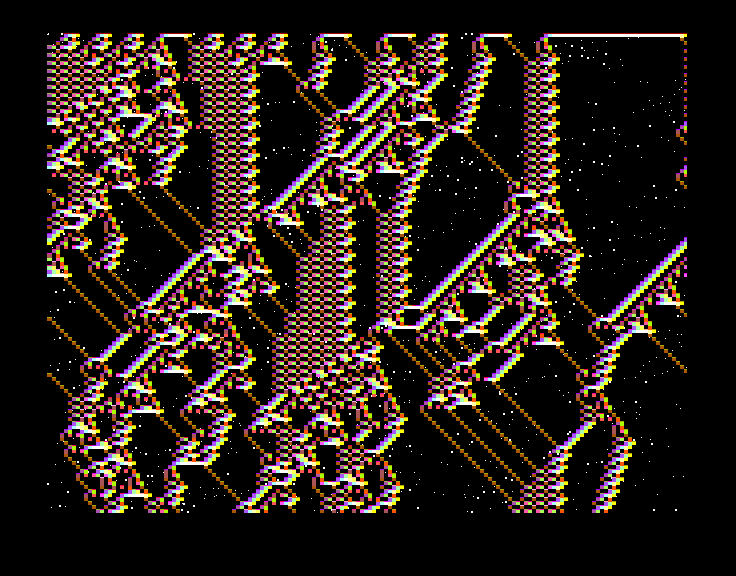

   

   

# Space CA ("Giant Computer in Space")

A real-time hardware VGA demo implementing a 1D cellular automaton evolving in space across a 160×120 grid against a procedural twinkling starfield, designed for the IHP 130nm SG13G2 process via Tiny Tapeout.

> 🎮 **[Run Interactive Live Demo in Browser on VGA Playground](https://vga-playground.com/?repo=https://github.com/znah/ttihp26b_space_ca)**

---



## Overview

**Space CA** visualizes space horizontally and time vertically on a standard 640×480 @ 60 Hz VGA display. The screen displays 120 successive generations of a 160-cell 1D elementary cellular automaton, with each cell rendered as a 4×4 pixel block.

- **Automaton Rule**: 5-cell neighborhood rule (`RULE = 32'h6C1E53A8`) with toroidal boundary wrapping.
- **Coloring**: Active cells are dynamically colored based on their local 5-bit neighborhood window `{1'b1, window}` mapped to 6-bit R2G2B2 color.
- **Starfield Background**: Inactive background pixels display a procedural starfield generated via hardware integer hashing (`starfield` module), complete with variable brightness and dynamic twinkling cycles.
- **Latch Line Buffer**: Two 160-bit transparent latch banks (`cells` and `first_row_cells`) maintain state across scanlines and frame boundaries without consuming standard flip-flop silicon area.
- **Dual-Mode Simulation & Synthesis**:
  - In simulation (VGA Playground / Verilator / Icarus), uses high-speed word-based array modeling for maximum frame rates.
  - In synthesis (Yosys / LibreLane), infers portable active-high `$_DLATCH_P_` latches (mapping directly to `sg13g2_dlhq_1` with 0 tie-high cells).

---

## Interactive Controls

| Input | Signal | Description |
|:-----:|:-------|:------------|
| `ui_in[0]` | `advance_mode` | `0`: Smooth vertical scrolling (advances 1 row per frame)<br>`1`: Full frame jump (advances 120 rows per frame) |
| `ui_in[1]` | `inject_gliders` | Injects gliders into cells 80..83 of row 0 |
| `ui_in[7:2]` | Unused | Reserved / tied off |

---

## VGA Pinout (Digital VGA PMOD)

Outputs connect directly to a standard Tiny Tapeout digital VGA PMOD:

| Pin | Function | Description |
|:---:|:---------|:------------|
| `uo_out[0]` | `R[1]` | Red bit 1 (MSB) |
| `uo_out[1]` | `G[1]` | Green bit 1 (MSB) |
| `uo_out[2]` | `B[1]` | Blue bit 1 (MSB) |
| `uo_out[3]` | `VSync` | Vertical Sync (active high) |
| `uo_out[4]` | `R[0]` | Red bit 0 (LSB) |
| `uo_out[5]` | `G[0]` | Green bit 0 (LSB) |
| `uo_out[6]` | `B[0]` | Blue bit 0 (LSB) |
| `uo_out[7]` | `HSync` | Horizontal Sync (active high) |

---

## Running Simulation & Hardening Locally

### 1. Interactive Verilator Simulation
```sh
make sim
```
Controls in the simulator window:
- `1`..`8`: Toggle `ui_in[0]`..`ui_in[7]`
- `P`: Pause / Resume
- `.` or `S`: Step 1 frame while paused
- `R`: Reset simulation

### 2. Cocotb Test Suite
```sh
cd test
make -B
```

### 3. Local ASIC Flow (LibreLane)
```sh
make build
```
To view the resulting layout:
```sh
make visualize          # Open in OpenROAD GUI
make visualize-klayout  # Open in KLayout
```

---

## Documentation & Shuttle

- Detailed documentation: [docs/info.md](docs/info.md)
- Shuttle Configuration: [info.yaml](info.yaml)
- Tiny Tapeout: [https://tinytapeout.com](https://tinytapeout.com)
